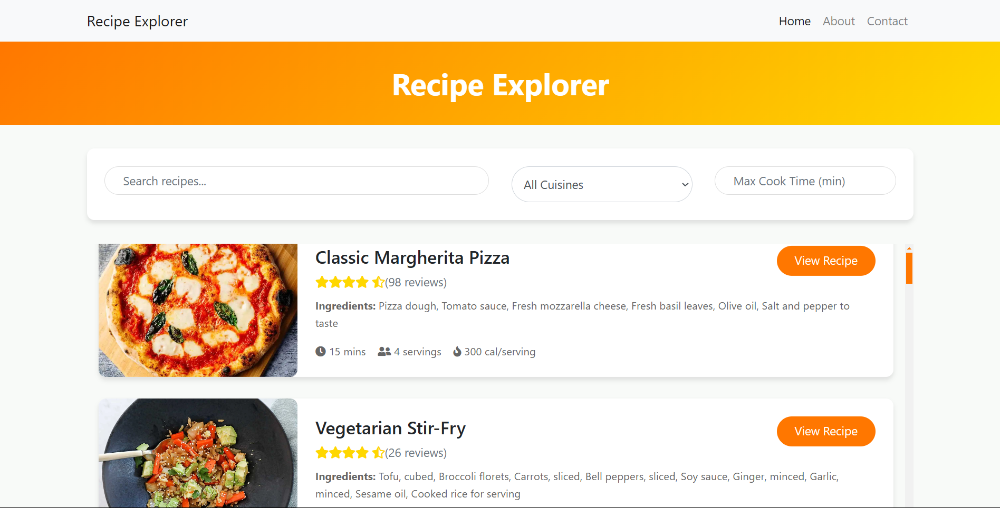

 To include a demo image in the README, follow these steps:

1. **Take a Screenshot**: Open your app in the browser and take a screenshot showing its main features (e.g., search, filters, and recipe cards).
   
2. **Save the Screenshot**: Name it something descriptive, like `demo.png` or `screenshot.png`.

3. **Add the Screenshot to Your Project Folder**: Place the image file in your project folder, ideally in a subfolder like `images/`.

4. **Update README to Display the Image**: Use Markdown to link the image in your README.

Here’s how your README could look with the demo image included:

---

# Recipe Explorer

Recipe Explorer is a web application designed to help users discover a variety of recipes based on their preferences. The app allows users to search, filter, and explore different recipes by cuisine, name, and cook time, providing a streamlined recipe browsing experience.
## API url: (https://dummyjson.com/recipes)

## Demo UI

## Features

- **Search Recipes**: Users can search for recipes by name.
- **Filter by Cuisine**: Filter recipes by cuisine type.
- **Filter by Cook Time**: Set a maximum cooking time to view recipes within a preferred timeframe.
- **Recipe Details**: Each recipe card displays the recipe name, image, rating, ingredients, cooking time, servings, and calories per serving.
- **Responsive Design**: Adaptable for various screen sizes, using Bootstrap for styling.

 